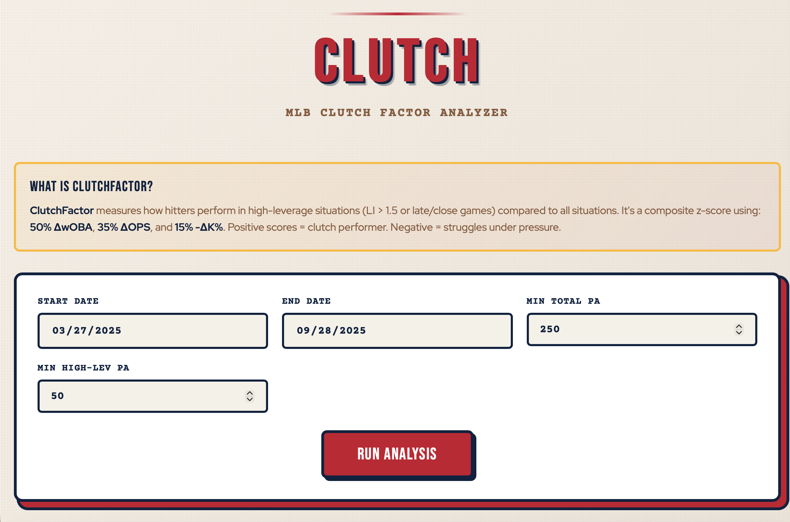

# CLUTCH — MLB Clutch Factor Analyzer (2025)

This is a web application that computes a hitter **ClutchFactor** for any selected timeframe using Statcast plate appearance data. Then displays all hitters who qualify based on PAs in a table

## High Leverage Definition
A plate appearance is flagged as **high leverage** if:
- `LI > 1.5` **OR**
- `inning >= 7 AND abs(bat_score - fld_score) <= 2`

If a Leverage Index (LI) column is not present in the pull, the model still works using the late/close rule.

## Metrics Used
Clutch performance is compared to **all situations** using:
- **wOBA** (from Statcast `woba_value / woba_denom`)
- **OPS** (computed from event outcomes; MVP approximation)
- **K%** (strikeouts / plate appearances)

For each metric:  
`Δmetric = metric_high_leverage - metric_all`

## Composite ClutchFactor (Weighted Z-Score)
We standardize each delta across players (z-score) and combine:
- 0.50 * z(ΔwOBA)
- 0.30 * z(ΔOPS)
- 0.20 * z(-ΔK%)  (lower K% in clutch is better)

## How to Run
```bash
pip install -r requirements.txt
pip install -r requirements-api.txt
python api.py
```
Simultaneously in a new Terminal:
```
python -m http.server 8080
```
Open http://localhost:8080/index.html in your browser

## Screenshots


